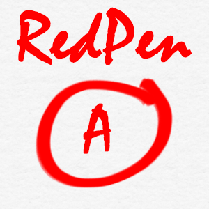

## RedPen
Redpen is an android application that was in development for the COM S 309 course project in the fall 2020 semester. The application intended to be a place for students to access their grades and receive feedback from their professors.
The frontend portion of the project was not completed. However, the backend has been implemented with all of the features our group originally sought to build at the start of the semester.
## Group Members:
#### Backend:
* [Christian Lisle](http://christianlisle.com/)
* [Carter Moseley](http://cartermoseley.com)
#### Frontend:
* Jonah Decker
* Victoria

## [RedPen Visual Demo](https://www.youtube.com/playlist?list=PLkmibBUrq1z2BMzC48vRbdsQASpj3ZLfe):
* [Overview](https://youtu.be/W9jD102f-Wc)
* [Christian's work (Backend)](https://youtu.be/W9jD102f-Wc?t=243)
* [WebSockets](https://youtu.be/MfkjgvNnmI0)